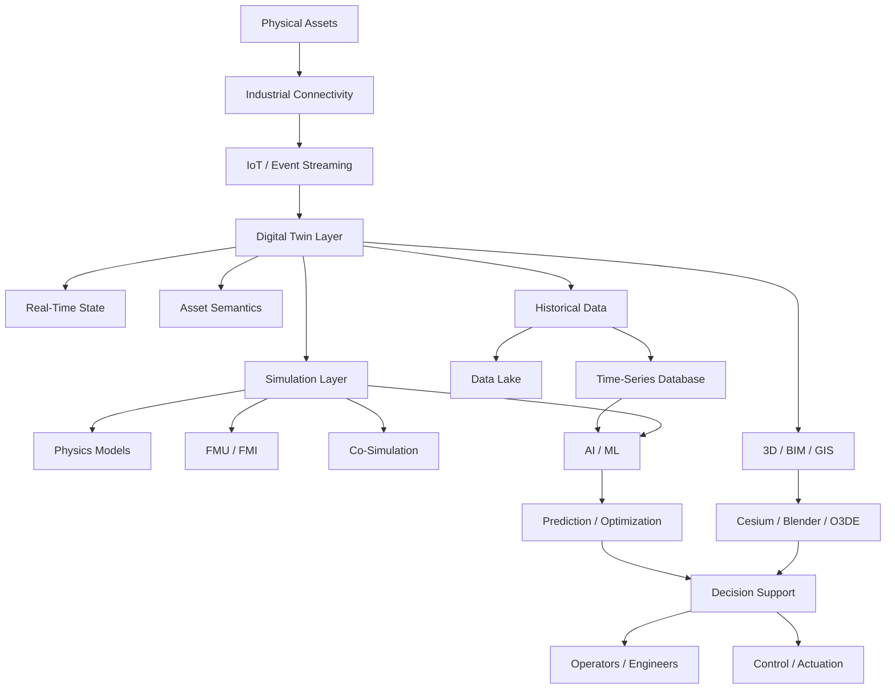
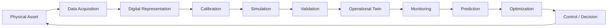
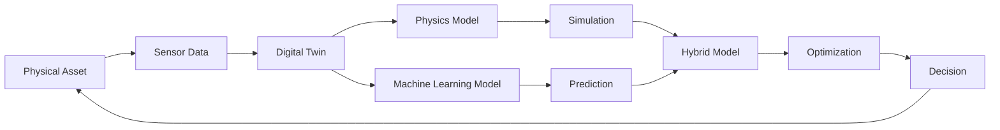

# Awesome-Simulation-n-Digital-Twin-Platform

## Top Simulation & Digital Twin Platforms — Commercial & Open-Source Alternatives

### Ansys Twin Builder · Siemens Simcenter · Dassault Systèmes 3DEXPERIENCE · Azure Digital Twins · AWS IoT TwinMaker · PTC ThingWorx · Altair Twin Activate · C3 AI Digital Twin · AVEVA PI System · Bentley iTwin

> **Focus:** Digital Twins · System Simulation · Physics-Based Modeling · Co-Simulation · IoT · Asset Performance · Predictive Maintenance · 3D/Spatial Twins · Industrial Metaverse · Open-Source Alternatives

**Last Updated:** September 2026

---

## Introduction

Digital Twin and Simulation platforms combine **physics-based simulation, real-time IoT data, engineering models, operational data, AI/ML, 3D visualization and lifecycle information** to create a continuously updated digital representation of a physical asset, machine, process, facility, vehicle, infrastructure system or entire industrial environment.

Leading commercial platforms include:

* [Ansys Twin Builder](https://www.ansys.com/products/digital-twin/ansys-twin-builder)
* [Siemens Simcenter](https://plm.sw.siemens.com/en-US/simcenter/)
* [Dassault Systèmes 3DEXPERIENCE](https://www.3ds.com/3dexperience)
* [Microsoft Azure Digital Twins](https://azure.microsoft.com/products/digital-twins)
* [AWS IoT TwinMaker](https://aws.amazon.com/iot-twinmaker/)
* [PTC ThingWorx](https://www.ptc.com/en/products/thingworx)
* [Altair Twin Activate](https://altair.com/twin-activate)
* [C3 AI Digital Twins](https://c3.ai/products/digital-twins/)
* [AVEVA PI System](https://www.aveva.com/en/products/aveva-pi-system/)
* [Bentley iTwin](https://www.bentley.com/software/itwin/)

These platforms differ significantly. Some are primarily **engineering simulation environments**, some are **IoT/digital-twin platforms**, while others concentrate on **industrial data historians, BIM/geospatial twins or enterprise asset intelligence**.

The open-source ecosystem is therefore best understood as a **composable technology stack**, rather than expecting one project to reproduce every capability of a commercial platform.

---

## Examples of Digital Twin Applications

Digital Twin platforms can be used for:

* Manufacturing and factory twins
* Industrial equipment twins
* Semiconductor manufacturing
* Automotive and aerospace systems
* Power plants and energy systems
* Smart buildings
* Smart cities
* Infrastructure and bridges
* Railways and transportation
* Oil & gas facilities
* Robotics
* Autonomous systems
* HVAC and building-energy simulation
* Predictive maintenance
* Asset performance management
* Process optimization
* Supply-chain simulation
* Fleet management
* Product lifecycle management
* Virtual commissioning
* Operator training
* What-if analysis
* Real-time monitoring
* Physics + AI hybrid modeling
* Engineering co-simulation
* 3D/BIM/geospatial digital twins

---

# Open-Source Emphasis

There is **no single open-source project that completely replaces Ansys Twin Builder + Simcenter + 3DEXPERIENCE + Azure Digital Twins + ThingWorx + iTwin simultaneously**.

However, a very capable open architecture can be constructed from open-source components covering:

* Digital Twin modeling
* Asset Administration Shell
* IoT connectivity
* Context management
* Time-series data
* Simulation
* FMI/FMU co-simulation
* Physics modeling
* Event streaming
* Edge computing
* AI/ML
* 3D visualization
* BIM/IFC
* Geospatial visualization
* Data lakes
* Workflow orchestration
* Monitoring and dashboards

Projects such as **Eclipse Ditto, Eclipse BaSyx, OpenTwins, FIWARE Orion-LD, ThingsBoard, OpenModelica, FMPy, Mosaik, IfcOpenShell and CesiumJS** are particularly important building blocks.

Eclipse Ditto provides an open-source digital-twin framework for representing connected physical devices as digital representations, while Eclipse BaSyx focuses heavily on Asset Administration Shells and Industry 4.0 interoperability. ([GitHub][1])

OpenTwins is particularly interesting because it explicitly combines open-source components to build compositional digital twins, including real-time, predicted and simulated data. ([GitHub][2])

---

# Table of Contents

* [SaaS / Hosted Platforms](#saas--hosted-platforms)
* [Open-Source Digital Twin Platforms](#open-source-digital-twin-platforms)
* [Open-Source Simulation & Co-Simulation](#open-source-simulation--co-simulation)
* [Open-Source IoT & Edge Platforms](#open-source-iot--edge-platforms)
* [Open-Source 3D, BIM & Spatial Twin Technologies](#open-source-3d-bim--spatial-twin-technologies)
* [Open-Source Data & Time-Series Infrastructure](#open-source-data--time-series-infrastructure)
* [Open-Source AI/ML for Digital Twins](#open-source-aiml-for-digital-twins)
* [Additional Strong Open-Source Options](#additional-strong-open-source-options)
* [Commercial Platform → Open-Source Equivalents](#commercial-platform--open-source-equivalents)
* [Frameworks for Building Custom Digital Twin Systems](#frameworks-for-building-custom-digital-twin-systems)
* [Reference Architecture](#reference-architecture)
* [Digital Twin Lifecycle](#digital-twin-lifecycle)
* [How to Contribute](#how-to-contribute)
* [Disclaimer](#disclaimer)

---

# SaaS / Hosted Platforms

These are commercial or managed platforms rather than open-source projects.

| Platform | Company Size (Valuation / Revenue) | Primary Focus | Typical Use | Pricing | Free Tier / Trial Limits |
| --- | --- | --- | --- | --- | --- |
| [Azure Digital Twins](https://azure.microsoft.com/products/digital-twins) | ~$3.1 Trillion (Rev: ~$245B) | Cloud twin graph + IoT | Buildings, facilities, industrial assets | Starts at $0.003 per 1,000 Digital Twin operations + $0.001 per 1,000 Query Units | 30-day free trial with $200 Azure credits via Azure Free Account (plus 12 months free services) |
| [NVIDIA Omniverse](https://www.nvidia.com/en-us/omniverse/) | ~$3.0 Trillion (Rev: ~$126B) | 3D simulation + industrial metaverse | Robotics, factories, synthetic environments | Free ($0/month) for individual developers; Enterprise support starts at $4,500/year per GPU | Free forever plan for individual creators/developers (unlimited local workstation GPU use); 30-day trial for Enterprise |
| [AWS IoT TwinMaker](https://aws.amazon.com/iot-twinmaker/) | ~$2.1 Trillion (Rev: ~$620B) | IoT + 3D + operational data | Industrial/operational twins | Starts at $0.02 per 1,000 Data Access API calls ($0.00002 per request) after free tier | Free tier includes 50 million Data Access API calls/month for the first 12 months |
| [IBM Maximo Application Suite](https://www.ibm.com/products/maximo) | ~$200 Billion (Rev: ~$62B) | Asset management + analytics | Asset performance | Essentials SaaS tier starts at ~$3,150/month (~$125/user/month AppPoints equivalence) | 14-day free trial of Maximo Application Suite SaaS with pre-configured sample asset data |
| [Siemens Simcenter](https://plm.sw.siemens.com/en-US/simcenter/) | ~$150 Billion (Rev: ~$80B) | CAE + system simulation + test | Engineering & industrial simulation | Starts at ~$300/month (~$3,500/year) for Simcenter Cloud HPC / Simcenter X starter tier | 30-day free trial for Simcenter Cloud HPC (includes 500 free HPC compute credits) |
| [Schneider Electric EcoStruxure](https://www.se.com/ww/en/work/solutions/ecostruxure/) | ~$130 Billion (Rev: ~$40B) | Energy + industrial IoT | Industrial/building twins | Starts at ~$50/monitored device/year (~$250/month for 50-node IT Expert base subscription) | 30-day free trial for EcoStruxure IT Expert (monitors up to 50 SNMP devices); 90-day trial for Data Center Expert |
| [Dassault Systèmes 3DEXPERIENCE](https://www.3ds.com/3dexperience) | ~$45 Billion (Rev: ~$6.5B) | PLM + simulation + 3D experience | Product & lifecycle twins | Starts at ~$250/user/month (~$3,000/user/year) for 3DEXPERIENCE Cloud Standard roles | 14-day free trial with full platform feature access |
| [Dassault SIMULIA](https://www.3ds.com/products/simulia) | ~$45 Billion (Rev: ~$6.5B) | Multiphysics simulation | Engineering | Starts at ~$350/month (~$4,000/year) per user simulation role / token package | 30-day free evaluation via 3DEXPERIENCE Cloud trial; Abaqus Learning Edition free forever (limited to 1,000 nodes) |
| [Ansys Twin Builder](https://www.ansys.com/products/digital-twin/ansys-twin-builder) | ~$32 Billion (Rev: ~$2.3B) | Physics + reduced-order models + hybrid analytics | Engineering digital twins | Starts at ~$1,500/month (~$18,000/year) per user node license | 30-day free trial (upon request); Free Student Edition (limited to 512,000 cells/nodes for academic use) |
| [Hexagon Nexus](https://nexus.hexagon.com/) | ~$25 Billion (Rev: ~$5.8B) | Manufacturing engineering ecosystem | Connected manufacturing | Starts at ~$150/month (~$1,800/year) per user application role / compute credits | Free registration with 30-day free trial for individual Nexus cloud applications (e.g., Adams Car on Demand) |
| [PTC ThingWorx](https://www.ptc.com/en/products/thingworx) | ~$20 Billion (Rev: ~$2.3B) | Industrial IoT + applications | Manufacturing & IIoT | Starts at ~$1,000/user/month (~$12,000/year) or ~$50,000/year base Foundation license | 30-day hosted developer evaluation / 90-day academic evaluation license via PTC Academic Program |
| [PTC Vuforia](https://www.ptc.com/en/products/vuforia) | ~$20 Billion (Rev: ~$2.3B) | AR + industrial visualization | Assisted operations | Basic Plan is $0/month; Premium Plan starts at ~$42/month (~$500/year) or $99/month for Vuforia Chalk Pro | Free forever Basic Plan (supports standard targets & up to 1,000 cloud recognitions/month); 30-day trial for Vuforia Chalk |
| [Bentley iTwin](https://www.bentley.com/software/itwin/) | ~$15 Billion (Rev: ~$1.3B) | Infrastructure digital twins | Civil infrastructure, BIM | Standard Subscription starts at $199/month (includes 200 credits/mo, 50 GB cloud storage; $1.20/credit overage) | Free forever Community Subscription (100 credits/month, 10 GB cloud data, 100 GB reality storage for non-commercial use) |
| [MathWorks Simulink](https://www.mathworks.com/products/simulink.html) | ~$15 Billion (Est.) (Rev: ~$1.5B) | Dynamic system simulation | Controls & model-based design | Starts at $55/month ($540/year) standard individual license subscription | 30-day free trial (full feature trial with MATLAB/Simulink Online access); MATLAB Online Basic offers 20 free hours/month forever |
| [AVEVA PI System](https://www.aveva.com/en/products/aveva-pi-system/) | ~$12 Billion (Acquired) (Rev: ~$1.4B) | Industrial historian + operational data | Process industries | Starts at ~$1,000/month (~$12,000/year) via CONNECT data services / AVEVA Flex subscription | 45-day free trial via CONNECT Data Services (includes up to 1,000 active streams) |
| [Altair Twin Activate](https://altair.com/twin-activate) | ~$9 Billion (Rev: ~$620M) | System simulation + reduced-order models | Engineering twins | Starts at ~$150/month (~$1,800/year) via Altair Units starter package | 30-day free trial via Altair One Marketplace; Free Student Edition (valid 1 year, max 50 components/model) |
| [C3 AI Digital Twins](https://c3.ai/products/digital-twins/) | ~$3 Billion (Rev: ~$310M) | AI + enterprise digital twins | Asset intelligence | Starts at $0.55/vCPU-hour (~$2,500/month base platform fee) or ~$250,000 3-month pilot deployment | 14-day free trial of C3 AI Studio with $500 cloud compute credits |
| [COMSOL Multiphysics](https://www.comsol.com/) | ~$1 Billion (Est.) (Rev: ~$130M) | Multiphysics simulation | Physics-based twins | Starts at ~$1,600/year for annual single-user term license (~$3,995 perpetual base license) | 14-day temporary evaluation license upon sales representative approval |

Ansys Twin Builder, for example, supports system models, digital twins, reduced-order modeling, hybrid analytics, co-simulation and deployment to IIoT environments. ([Ansys][3])

---

# Open-Source Digital Twin Platforms

## 1. Eclipse Ditto

[GitHub](https://github.com/eclipse-ditto/ditto) · [Project](https://eclipse.dev/ditto/)

**License:** EPL-2.0

One of the most important open-source foundations for IoT-oriented digital twins.

### Features

* Digital Thing abstraction
* Twin state management
* Desired/reported/current state
* REST APIs
* WebSocket APIs
* MQTT
* AMQP
* Apache Kafka integration
* Access-control policies
* Twin search
* Event notifications
* Horizontal scalability
* Kubernetes deployment
* Device-as-a-Service architecture

Ditto is particularly strong as the **digital-twin backend/state layer**, rather than as a physics simulation engine. ([GitHub][1])

---

## 2. Eclipse BaSyx

[GitHub](https://github.com/eclipse-basyx) · [Project](https://eclipse.dev/basyx/)

**License:** Eclipse open-source ecosystem

A major open-source Industry 4.0 / Asset Administration Shell ecosystem.

### Features

* Asset Administration Shell
* AAS submodels
* Industry 4.0 interoperability
* Digital representations of assets
* AAS repositories
* AAS registries
* Data bridges
* OPC UA integration
* Java SDK
* Python SDK
* Go SDK
* TypeScript SDK
* .NET SDK
* Rust SDK
* Web UI
* Kubernetes/Helm deployment

BaSyx is particularly valuable when the Digital Twin needs **industrial asset semantics and standardized AAS representations**. ([GitHub][4])

---

## 3. OpenTwins

[GitHub](https://github.com/ertis-research/opentwins)

**Focus:** Open-source compositional Digital Twin platform

OpenTwins is designed to assemble a complete Digital Twin platform from open-source technologies.

Its architecture combines technologies such as:

* Eclipse Ditto
* Eclipse Hono
* Apache Kafka
* InfluxDB
* Grafana
* Telegraf
* Digital Twin APIs
* Simulation/prediction components

It explicitly targets twins incorporating **real-time, predicted and simulated information**. The project is still under development, so production readiness should be evaluated carefully. ([GitHub][5])

---

## 4. FIWARE

[GitHub](https://github.com/FIWARE)

**Focus:** Context-aware applications and Digital Twins

FIWARE is one of the strongest open-source ecosystems for **smart cities, industrial context management and NGSI-LD-based digital twins**.

Important components include:

* Orion-LD
* Scorpio
* Draco
* QuantumLeap
* Cygnus
* IoT Agents
* Smart Data Models

### Orion-LD

[GitHub](https://github.com/FIWARE/context.Orion-LD)

Supports:

* NGSI-LD
* NGSI-v2
* Linked Data
* Context management
* Entity relationships
* Temporal representation
* Subscriptions
* MQTT
* Kafka integration

Orion-LD's January 2026 release was 1.12.0 and implements NGSI-LD/NGSI-v2 context management. ([GitHub][6])

---

## 5. ThingsBoard Community Edition

[GitHub](https://github.com/thingsboard/thingsboard)

**License:** Apache-2.0

A mature open-source IoT platform that can act as the operational layer around a Digital Twin.

### Features

* Device management
* Asset management
* Telemetry
* Time-series data
* Rule engine
* Alarms
* Dashboards
* SCADA-style visualization
* RPC
* Entity relationships
* MQTT
* HTTP
* CoAP
* Gateway support
* Edge deployment

ThingsBoard supports device/asset relationships, telemetry, dashboards, alarms and rule chains, making it useful as a practical operational Digital Twin foundation. ([GitHub][7])

---

# Open-Source Simulation & Co-Simulation

These projects are especially relevant when the goal is to reproduce the **simulation side of Ansys Twin Builder, Simcenter, Altair Twin Activate or SIMULIA**.

---

## 6. OpenModelica

[GitHub](https://github.com/OpenModelica/OpenModelica)

**License:** Open Source

A major open-source Modelica-based modeling and simulation environment.

### Components

* OpenModelica Compiler
* OMEdit
* OMSimulator
* OMNotebook
* OMPlot
* OMOptim
* FMI support
* Modelica libraries
* Co-simulation

OpenModelica is particularly valuable for **physics-based system modeling and engineering simulation**. ([GitHub][8])

---

## 7. FMPy

[GitHub](https://github.com/CATIA-Systems/FMPy)

**License:** BSD-2-Clause

Python-based FMI simulation framework.

### Features

* FMI 1.0
* FMI 2.0
* FMI 3.0
* Model Exchange
* Co-Simulation
* FMU execution
* Python API
* GUI
* Web application
* Jupyter integration
* C/C++ FMU debugging

FMPy is particularly useful for connecting different simulation tools through **Functional Mock-up Units (FMUs)**. ([GitHub][9])

---

## 8. Mosaik

[GitHub](https://github.com/OFFIS-mosaik/mosaik)

**License:** LGPL

A powerful co-simulation framework originally focused strongly on smart-grid simulations.

### Features

* Simulator composition
* Scenario creation
* Time synchronization
* Large-scale simulation
* Smart-grid models
* Python integration
* Multi-simulator orchestration

([GitHub][10])

---

## 9. FMI / Functional Mock-up Interface

[Modelica Association](https://fmi-standard.org/)

FMI is not itself a Digital Twin platform, but it is one of the most important interoperability standards for connecting simulation models.

It enables:

* Model Exchange
* Co-Simulation
* FMUs
* Multi-tool simulation
* Hardware/software model integration
* Digital Twin model portability

---

## 10. Project Chrono

[GitHub](https://github.com/projectchrono/chrono)

**Focus:** Physics-based simulation

Useful for:

* Multibody dynamics
* Vehicle simulation
* Robotics
* Mechanical systems
* Fluid/vehicle interaction
* Real-time simulation

---

## 11. Gazebo

[GitHub](https://github.com/gazebosim/gz-sim)

**Focus:** Robotics simulation

Useful for:

* Robot Digital Twins
* Sensors
* Actuators
* Autonomous systems
* Physics simulation
* ROS integration
* Virtual commissioning

---

## 12. Webots

[GitHub](https://github.com/cyberbotics/webots)

**License:** Apache-2.0

Open-source robotics and physics simulation platform.

Useful for:

* Robotics
* Autonomous vehicles
* Sensor simulation
* Robot twins
* Reinforcement learning
* Virtual testing

---

# Open-Source IoT & Edge Platforms

These projects provide the connectivity layer required to feed real-world data into Digital Twins.

## 13. Eclipse Hono

[GitHub](https://github.com/eclipse-hono/hono)

**License:** EPL-2.0

Scalable IoT device connectivity infrastructure.

### Features

* MQTT
* HTTP
* AMQP
* Device identity
* Authentication
* Telemetry
* Command & control
* Apache Kafka integration
* Cloud backend connectivity

([GitHub][11])

---

## 14. Eclipse EdgeX Foundry

[GitHub](https://github.com/edgexfoundry/edgex-go)

**Focus:** Industrial IoT Edge

Provides:

* Device services
* Protocol translation
* MQTT
* Modbus
* OPC UA
* REST
* Edge analytics
* Rules
* Device management
* Cloud connectivity

EdgeX is particularly useful for connecting legacy industrial equipment to a Digital Twin architecture. ([GitHub][12])

---

## 15. Mainflux / Magistrala

[GitHub](https://github.com/absmach/magistrala)

Open-source IoT infrastructure supporting:

* MQTT
* HTTP
* WebSocket
* CoAP
* Device management
* Authentication
* Access control
* Data routing
* Kubernetes
* Docker

The original Mainflux repository has migrated its continuing development to Magistrala. ([GitHub][13])

---

## 16. Eclipse Mosquitto

[GitHub](https://github.com/eclipse-mosquitto/mosquitto)

Lightweight MQTT broker.

Useful for:

* IoT telemetry
* Device-to-twin communication
* Edge deployments
* Digital Twin messaging

---

## 17. Node-RED

[GitHub](https://github.com/node-red/node-red)

Low-code event-driven programming platform useful for:

* IoT integration
* Protocol conversion
* Data transformation
* Twin workflows
* MQTT
* REST
* OPC UA
* Industrial automation

---

# Open-Source 3D, BIM & Spatial Twin Technologies

These are particularly relevant to **Bentley iTwin, Azure Digital Twins spatial applications, AWS IoT TwinMaker and 3DEXPERIENCE-style visualization**.

---

## 18. CesiumJS

[GitHub](https://github.com/CesiumGS/cesium)

**License:** Apache-2.0

Open-source 3D geospatial visualization platform.

### Useful for

* 3D Digital Twins
* Cities
* Infrastructure
* Terrain
* GIS
* BIM visualization
* Satellites
* Geospatial simulation
* Time-dynamic visualization

---

## 19. Open 3D Engine (O3DE)

[GitHub](https://github.com/o3de/o3de)

**License:** Apache-2.0

High-performance open-source 3D engine capable of building interactive simulation environments and industrial virtual worlds.

Useful for:

* Industrial Digital Twins
* Robotics
* Simulation
* Synthetic environments
* Visualization
* Training
* Autonomous systems

O3DE explicitly supports high-fidelity simulation and real-time 3D environments. ([GitHub][14])

---

## 20. IfcOpenShell

[GitHub](https://github.com/IfcOpenShell/IfcOpenShell)

**License:** LGPL

Open-source IFC/BIM library.

### Features

* IFC2x3
* IFC4
* IFC4x3
* Geometry processing
* IFC conversion
* Python API
* C++ API
* BCF
* IDS
* Bonsai BIM integration

It is especially useful for creating **BIM-based infrastructure and building Digital Twins**. ([GitHub][15])

---

## 21. Blender + Bonsai

[Blender](https://github.com/blender/blender) · [Bonsai](https://github.com/IfcOpenShell/IfcOpenShell/tree/v0.8.4/src/bonsai)

Useful for:

* 3D asset visualization
* BIM
* IFC
* Digital Twin visualization
* Architectural models
* Infrastructure models

---

## 22. OpenStreetMap

[OpenStreetMap](https://www.openstreetmap.org/)

Useful as an open geospatial data source for:

* Smart-city twins
* Transportation twins
* Infrastructure twins
* Urban simulation
* GIS applications

---

# Open-Source Data & Time-Series Infrastructure

A Digital Twin requires a persistent operational-data layer.

## 23. InfluxDB

[GitHub](https://github.com/influxdata/influxdb)

Useful for:

* Sensor data
* Telemetry
* Time-series data
* Equipment history
* Environmental measurements

---

## 24. TimescaleDB

[GitHub](https://github.com/timescale/timescaledb)

PostgreSQL-based time-series database.

Useful for:

* Industrial telemetry
* Asset histories
* Event data
* Long-term twin state
* SQL analytics

---

## 25. Apache Kafka

[GitHub](https://github.com/apache/kafka)

Distributed event-streaming platform.

Useful for:

* Real-time twin synchronization
* Event streams
* Sensor ingestion
* Simulation outputs
* Digital Twin events
* Data integration

---

## 26. Apache Flink

[GitHub](https://github.com/apache/flink)

Useful for:

* Real-time analytics
* Stream processing
* Event detection
* Twin state computation
* Anomaly detection

---

## 27. Apache Spark

[GitHub](https://github.com/apache/spark)

Useful for:

* Historical twin analytics
* Large-scale simulation data
* Machine learning
* Batch processing

---

## 28. DuckDB

[GitHub](https://github.com/duckdb/duckdb)

Excellent lightweight analytical database for:

* Digital Twin analytics
* Parquet data
* Simulation datasets
* Engineering analysis
* Local/offline analytics

---

## 29. MinIO

[GitHub](https://github.com/minio/minio)

S3-compatible object storage suitable for:

* Simulation files
* FMUs
* CAD/BIM models
* Sensor datasets
* ML datasets
* Digital Twin historical archives

---

# Open-Source AI/ML for Digital Twins

Digital Twins increasingly combine physics-based models with machine learning.

## 30. PyTorch

[GitHub](https://github.com/pytorch/pytorch)

Useful for:

* Surrogate models
* Neural Digital Twins
* Predictive maintenance
* Physics-informed ML
* Computer vision
* Reinforcement learning

---

## 31. TensorFlow

[GitHub](https://github.com/tensorflow/tensorflow)

Useful for:

* Predictive models
* Sensor analytics
* Anomaly detection
* Time-series forecasting

---

## 32. scikit-learn

[GitHub](https://github.com/scikit-learn/scikit-learn)

Useful for:

* Regression
* Classification
* Clustering
* Fault detection
* Predictive maintenance
* Surrogate modeling

---

## 33. XGBoost

[GitHub](https://github.com/dmlc/xgboost)

Excellent for:

* Asset failure prediction
* Yield prediction
* Remaining useful life
* Feature-based industrial analytics

---

## 34. PyOD

[GitHub](https://github.com/yzhao062/pyod)

Open-source anomaly detection toolkit.

Useful for:

* Sensor anomalies
* Equipment faults
* Process deviations
* Twin health monitoring

---

## 35. MLflow

[GitHub](https://github.com/mlflow/mlflow)

Useful for:

* Model lifecycle management
* Experiment tracking
* Model deployment
* Digital Twin ML pipelines

---

# Additional Strong Open-Source Options

The following projects may not individually be complete Digital Twin platforms, but they can be extremely valuable components.

### Digital Twin / Context

* [Eclipse Ditto](https://github.com/eclipse-ditto/ditto)
* [Eclipse BaSyx](https://github.com/eclipse-basyx)
* [OpenTwins](https://github.com/ertis-research/opentwins)
* [FIWARE](https://github.com/FIWARE)
* [Orion-LD](https://github.com/FIWARE/context.Orion-LD)
* [ThingsBoard](https://github.com/thingsboard/thingsboard)
* [Mainflux / Magistrala](https://github.com/absmach/magistrala)

### Simulation

* [OpenModelica](https://github.com/OpenModelica/OpenModelica)
* [FMPy](https://github.com/CATIA-Systems/FMPy)
* [Mosaik](https://github.com/OFFIS-mosaik/mosaik)
* [Project Chrono](https://github.com/projectchrono/chrono)
* [Gazebo](https://github.com/gazebosim/gz-sim)
* [Webots](https://github.com/cyberbotics/webots)
* [PyBullet](https://github.com/bulletphysics/bullet3)
* [SimPy](https://github.com/simpx/simpy)

### IoT / Edge

* [Eclipse Hono](https://github.com/eclipse-hono/hono)
* [Eclipse Mosquitto](https://github.com/eclipse-mosquitto/mosquitto)
* [Eclipse EdgeX Foundry](https://github.com/edgexfoundry/edgex-go)
* [Node-RED](https://github.com/node-red/node-red)
* [NATS](https://github.com/nats-io/nats-server)

### 3D / BIM / GIS

* [CesiumJS](https://github.com/CesiumGS/cesium)
* [Open 3D Engine](https://github.com/o3de/o3de)
* [IfcOpenShell](https://github.com/IfcOpenShell/IfcOpenShell)
* [Blender](https://github.com/blender/blender)
* [OpenStreetMap](https://github.com/openstreetmap/openstreetmap-website)
* [OpenLayers](https://github.com/openlayers/openlayers)

### Data

* [InfluxDB](https://github.com/influxdata/influxdb)
* [TimescaleDB](https://github.com/timescale/timescaledb)
* [PostgreSQL](https://github.com/postgres/postgres)
* [ClickHouse](https://github.com/ClickHouse/ClickHouse)
* [DuckDB](https://github.com/duckdb/duckdb)
* [Apache Kafka](https://github.com/apache/kafka)
* [Apache Flink](https://github.com/apache/flink)
* [Apache Spark](https://github.com/apache/spark)
* [MinIO](https://github.com/minio/minio)

### Visualization

* [Grafana](https://github.com/grafana/grafana)
* [Apache Superset](https://github.com/apache/superset)
* [Metabase](https://github.com/metabase/metabase)
* [Plotly](https://github.com/plotly/plotly.py)
* [CesiumJS](https://github.com/CesiumGS/cesium)

### AI / ML

* [PyTorch](https://github.com/pytorch/pytorch)
* [TensorFlow](https://github.com/tensorflow/tensorflow)
* [scikit-learn](https://github.com/scikit-learn/scikit-learn)
* [XGBoost](https://github.com/dmlc/xgboost)
* [LightGBM](https://github.com/microsoft/LightGBM)
* [PyOD](https://github.com/yzhao062/pyod)
* [MLflow](https://github.com/mlflow/mlflow)

---

# Commercial Platform → Open-Source Equivalents

| Commercial Platform      | Main Capability                             | Strong Open-Source Alternatives                       |
| ------------------------ | ------------------------------------------- | ----------------------------------------------------- |
| **Ansys Twin Builder**   | Physics + system simulation + digital twins | OpenModelica + FMPy + Mosaik + Project Chrono         |
| **Siemens Simcenter**    | CAE + system simulation                     | OpenModelica + FMPy + Mosaik + Gazebo + Chrono        |
| **3DEXPERIENCE**         | PLM + simulation + 3D                       | OpenModelica + IfcOpenShell + Blender + O3DE + Cesium |
| **Azure Digital Twins**  | Twin graph + IoT + cloud                    | Eclipse Ditto + FIWARE + ThingsBoard                  |
| **AWS IoT TwinMaker**    | IoT + 3D + operational data                 | Ditto + Hono + Kafka + InfluxDB + CesiumJS            |
| **PTC ThingWorx**        | IIoT + applications                         | ThingsBoard + EdgeX + Ditto + Node-RED                |
| **Altair Twin Activate** | System modeling + simulation                | OpenModelica + FMPy + Mosaik                          |
| **C3 AI Digital Twins**  | AI + enterprise asset twins                 | Ditto + FIWARE + PyTorch + XGBoost + MLflow           |
| **AVEVA PI System**      | Historian + operational data                | InfluxDB + TimescaleDB + PostgreSQL + Kafka           |
| **Bentley iTwin**        | Infrastructure/BIM twins                    | IfcOpenShell + CesiumJS + Blender + O3DE              |
| **NVIDIA Omniverse**     | 3D + simulation                             | O3DE + Blender + Gazebo + Cesium                      |
| **SIMULIA**              | Multiphysics                                | OpenModelica + Project Chrono + OpenFOAM              |
| **Simulink**             | Dynamic system modeling                     | OpenModelica + FMPy + Python scientific stack         |

> **Important:** These are capability-oriented equivalents, not claims of complete feature-for-feature parity. Commercial platforms integrate many capabilities into a single supported product, while open-source architectures generally require multiple components.

---

# Frameworks for Building Custom Digital Twin Systems

A powerful open-source Digital Twin can be constructed as a layered architecture.

### Recommended Stack

| Layer                   | Recommended Open-Source Technologies      |
| ----------------------- | ----------------------------------------- |
| Physical assets         | Sensors · PLCs · Robots · Machines        |
| Industrial connectivity | EdgeX · Hono · OPC UA · MQTT              |
| Messaging               | Mosquitto · Kafka · NATS                  |
| Digital Twin model      | Eclipse Ditto · BaSyx · FIWARE            |
| Asset semantics         | AAS · NGSI-LD · OPC UA information models |
| Time-series             | InfluxDB · TimescaleDB                    |
| Data lake               | MinIO · Parquet · Iceberg                 |
| Simulation              | OpenModelica · FMPy · Mosaik              |
| Physics                 | Chrono · OpenFOAM · PyBullet              |
| AI/ML                   | PyTorch · XGBoost · scikit-learn · PyOD   |
| Workflow                | Node-RED · Airflow · Dagster              |
| 3D                      | CesiumJS · Blender · O3DE                 |
| BIM                     | IfcOpenShell · Bonsai                     |
| Visualization           | Grafana · Superset · Metabase             |
| Containerization        | Docker · Kubernetes                       |
| Observability           | Prometheus · Grafana · OpenTelemetry      |

---

# Reference Architecture

---

# Digital Twin Lifecycle

---

# Typical Open-Source Digital Twin Workflow

### 1. Connect the asset

Use:

* MQTT
* OPC UA
* Modbus
* CAN
* HTTP
* CoAP

Possible technologies:

* Eclipse Hono
* EdgeX Foundry
* Mosquitto
* Node-RED

### 2. Create the Digital Twin

Use:

* Eclipse Ditto
* Eclipse BaSyx
* FIWARE Orion-LD
* ThingsBoard

### 3. Store historical data

Use:

* InfluxDB
* TimescaleDB
* PostgreSQL
* ClickHouse
* MinIO

### 4. Build the simulation model

Use:

* OpenModelica
* FMPy
* FMI
* Mosaik
* Project Chrono
* OpenFOAM
* Gazebo

### 5. Synchronize simulation and reality

The twin can combine:

* Live sensor values
* Historical measurements
* Physics models
* Reduced-order models
* ML predictions
* Simulation results

### 6. Add AI

Possible functions:

* Anomaly detection
* Predictive maintenance
* Remaining useful life
* Failure prediction
* Process optimization
* Parameter estimation
* Soft sensors
* Surrogate models

### 7. Add 3D

Use:

* CesiumJS
* Blender
* IfcOpenShell
* O3DE

### 8. Build operational dashboards

Use:

* Grafana
* Superset
* Metabase
* Custom React/Vue applications

---

# Digital Twin Types

## Asset Twin

Represents one machine or physical asset.

**Example:**

`Pump → Sensors → Ditto/BaSyx → Time-Series → Predictive Model`

---

## Product Twin

Represents a product throughout its lifecycle.

Useful for:

* Automotive
* Aerospace
* Electronics
* Semiconductor equipment
* Medical devices

---

## Process Twin

Represents an industrial process.

Useful for:

* Chemical plants
* Refineries
* Manufacturing
* Semiconductor fabs
* Food processing

---

## Factory Twin

Represents:

* Machines
* Robots
* Production lines
* Material flows
* Operators
* Energy consumption

---

## Infrastructure Twin

Represents:

* Bridges
* Roads
* Railways
* Airports
* Buildings
* Utilities

A strong open-source combination is:

**IfcOpenShell + CesiumJS + PostgreSQL/PostGIS + IoT platform + Digital Twin layer**

---

## City Twin

A typical architecture can combine:

**FIWARE + NGSI-LD + CesiumJS + OpenStreetMap + Kafka + PostGIS + Grafana**

---

# Physics + AI Hybrid Digital Twin

One of the most powerful architectures is to combine physics models with machine learning.

This architecture can provide:

* Physics-based explainability
* ML-based prediction
* Faster surrogate models
* Fault detection
* What-if analysis
* Predictive maintenance
* Real-time optimization

---

# Suggested Open-Source Architecture by Use Case

| Use Case               | Recommended Stack                                     |
| ---------------------- | ----------------------------------------------------- |
| IoT Digital Twin       | Ditto + Hono + Kafka + InfluxDB                       |
| Industry 4.0           | BaSyx + AAS + OPC UA + Kafka                          |
| Smart City             | FIWARE + NGSI-LD + CesiumJS + PostGIS                 |
| Factory Twin           | EdgeX + Ditto + Kafka + Grafana                       |
| Physics Twin           | OpenModelica + FMPy + FMI                             |
| Co-Simulation          | OpenModelica + FMPy + Mosaik                          |
| Robotics Twin          | Gazebo + ROS 2 + O3DE                                 |
| Infrastructure Twin    | IfcOpenShell + CesiumJS + PostGIS                     |
| Building Twin          | IFC/BIM + CesiumJS + IoT + EnergyPlus                 |
| Predictive Maintenance | Ditto + InfluxDB + PyTorch/XGBoost                    |
| AI Digital Twin        | Ditto/FIWARE + PyTorch + MLflow                       |
| Industrial Historian   | TimescaleDB/InfluxDB + Kafka + Grafana                |
| 3D Industrial Twin     | O3DE + CesiumJS + Blender                             |
| Semiconductor Twin     | Ditto/BaSyx + Kafka + TimescaleDB + OpenModelica + ML |

---

# Closest Open-Source Substitutes by Commercial Category

### Ansys Twin Builder

Best open-source combination:

**OpenModelica + FMPy + FMI + Mosaik + PyTorch**

---

### Siemens Simcenter

Best open-source combination:

**OpenModelica + FMPy + Chrono + OpenFOAM + Mosaik**

---

### Dassault 3DEXPERIENCE

Best open-source combination:

**OpenModelica + Blender + IfcOpenShell + O3DE + CesiumJS + PostgreSQL**

---

### Azure Digital Twins

Best open-source combination:

**Eclipse Ditto + FIWARE + Kafka + PostgreSQL + Grafana**

---

### AWS IoT TwinMaker

Best open-source combination:

**Eclipse Ditto + Hono + Kafka + InfluxDB + CesiumJS + Grafana**

---

### PTC ThingWorx

Best open-source combination:

**ThingsBoard + EdgeX Foundry + Ditto + Node-RED + Kafka**

---

### Altair Twin Activate

Best open-source combination:

**OpenModelica + FMPy + FMI + Mosaik**

---

### C3 AI Digital Twin

Best open-source combination:

**Ditto/FIWARE + PyTorch + XGBoost + MLflow + Kafka + TimescaleDB**

---

### AVEVA PI

Best open-source combination:

**InfluxDB/TimescaleDB + Kafka + Grafana + PostgreSQL**

---

### Bentley iTwin

Best open-source combination:

**IfcOpenShell + CesiumJS + Blender + PostGIS + FIWARE**

---

# Recommended Open-Source Core Stack

If the objective is to build a serious general-purpose open-source Digital Twin platform, a particularly strong combination would be:

### Digital Twin Core

**Eclipse Ditto**

### Industrial Asset Model

**Eclipse BaSyx / Asset Administration Shell**

### Context Layer

**FIWARE Orion-LD**

### Connectivity

**Eclipse Hono + EdgeX Foundry**

### Messaging

**Apache Kafka + Eclipse Mosquitto**

### Time-Series

**TimescaleDB / InfluxDB**

### Simulation

**OpenModelica + FMI + FMPy**

### Co-Simulation

**Mosaik**

### AI

**PyTorch + XGBoost + scikit-learn + MLflow**

### 3D

**CesiumJS + Blender + O3DE**

### BIM

**IfcOpenShell**

### Visualization

**Grafana + Apache Superset**

### Object Storage

**MinIO**

### Orchestration

**Kubernetes**

This stack can provide a highly capable open architecture without depending on a single proprietary Digital Twin vendor.

---

# Why Open Source Is Particularly Interesting for Digital Twins

Open-source Digital Twin architectures offer several important advantages:

* Avoid vendor lock-in
* Full control over data
* On-premise deployment
* Edge deployment
* Cloud independence
* Custom simulation models
* Custom AI models
* Open standards
* Interoperability
* Ability to integrate legacy systems
* Easier research experimentation
* Greater control over APIs
* Ability to customize twin semantics
* Long-term maintainability

The major disadvantage is that an open-source solution usually requires **systems integration**. A commercial platform may provide simulation, data management, visualization, security, lifecycle management and vendor support as one integrated product, whereas an open architecture requires those capabilities to be assembled and maintained separately.

---

# How to Contribute

Contributions are welcome across the Digital Twin ecosystem.

### You can contribute by:

* Adding open-source Digital Twin projects
* Adding simulation engines
* Adding FMI/FMU tools
* Adding AAS implementations
* Adding NGSI-LD projects
* Adding IoT platforms
* Adding BIM/IFC tools
* Adding 3D engines
* Adding AI/ML frameworks
* Improving documentation
* Adding architecture diagrams
* Adding deployment examples
* Reporting outdated links
* Correcting license information
* Adding real-world Digital Twin use cases

### Especially welcome

* Industrial Digital Twin projects
* Semiconductor Digital Twin projects
* Factory Digital Twin implementations
* Open-source physics models
* FMI/FMU projects
* Open-source predictive-maintenance systems
* BIM + IoT Digital Twins
* Smart-city Digital Twins
* Robotics Digital Twins
* Open-source Digital Twin benchmarks

---

# Disclaimer

This repository is intended as a **technology-discovery and comparison resource**.

Commercial platforms and open-source projects are not necessarily feature-for-feature equivalents. In particular:

* A simulation engine is not necessarily a Digital Twin platform.
* An IoT platform is not necessarily a physics simulation system.
* A historian is not necessarily a Digital Twin.
* A 3D engine is not necessarily a Digital Twin platform.
* An open-source component may require several additional services to achieve enterprise functionality.
* Licensing terms should always be verified against the project's current license and release.
* Production suitability, security, scalability and support should be evaluated independently.
* Commercial product names and trademarks belong to their respective owners.

---

# Final Perspective

The most realistic open-source alternative to the major commercial Digital Twin ecosystem is **not one product** but a composable architecture.

A particularly powerful foundation is:

**Eclipse Ditto + Eclipse BaSyx + FIWARE + Eclipse Hono + EdgeX + Kafka + TimescaleDB/InfluxDB + OpenModelica + FMI/FMPy + Mosaik + PyTorch + CesiumJS + IfcOpenShell + Grafana**

This combination can cover much of the functional territory represented by **Azure Digital Twins, AWS IoT TwinMaker, ThingWorx, Ansys Twin Builder, Simcenter, 3DEXPERIENCE, Altair Twin Activate, C3 AI Digital Twins, AVEVA PI and Bentley iTwin**, while retaining the flexibility, transparency and extensibility of an open-source architecture.

The most important projects to investigate first are **Eclipse Ditto, Eclipse BaSyx, OpenTwins, FIWARE Orion-LD, OpenModelica, FMPy, Mosaik, ThingsBoard, EdgeX Foundry, CesiumJS and IfcOpenShell**. ([Eclipse Foundation][16])

**Open Digital Twin architecture is therefore best viewed as an ecosystem: model + connectivity + context + simulation + data + AI + visualization — rather than as a single software package.**

[1]: https://github.com/eclipse-ditto/ditto?utm_source=chatgpt.com "GitHub - eclipse-ditto/ditto: Eclipse Ditto™: Digital Twin framework of Eclipse IoT - main repository · GitHub"
[2]: https://github.com/liuyinling/OpenTwins/blob/main/README.md?utm_source=chatgpt.com "OpenTwins/README.md at main · liuyinling/OpenTwins · GitHub"
[3]: https://ansys.synopsys.com/en-in/products/digital-twin/ansys-twin-builder?utm_source=chatgpt.com "Ansys Twin Builder | Create and Deploy Digital Twin Models"
[4]: https://github.com/eclipse-basyx?utm_source=chatgpt.com "Eclipse BaSyx™ · GitHub"
[5]: https://github.com/liuyinling/OpenTwins?utm_source=chatgpt.com "GitHub - liuyinling/OpenTwins: This platform has been designed to facilitate the development of digital twins and is characterised by the exclusive use of open source components. The aim is to achieve a platform that covers all the functionalities that a digital twin may require. · GitHub"
[6]: https://github.com/FIWARE/context.Orion-LD?utm_source=chatgpt.com "GitHub - FIWARE/context.Orion-LD: Context Broker and CEF building block for context data management which supports both the NGSI-LD and the NGSI-v2 APIs · GitHub"
[7]: https://github.com/thingsboard/thingsboard?utm_source=chatgpt.com "GitHub - thingsboard/thingsboard: Open-source IoT Platform - Device management, data collection, processing and visualization. · GitHub"
[8]: https://github.com/OpenModelica/OpenModelica?utm_source=chatgpt.com "GitHub - OpenModelica/OpenModelica: OpenModelica is an open-source Modelica-based modeling and simulation environment intended for industrial and academic usage. · GitHub"
[9]: https://github.com/CATIA-Systems/FMPy?utm_source=chatgpt.com "GitHub - CATIA-Systems/FMPy: Simulate Functional Mock-up Units (FMUs) in Python · GitHub"
[10]: https://github.com/OFFIS-mosaik/mosaik?utm_source=chatgpt.com "GitHub - OFFIS-mosaik/mosaik: A flexible Smart Grid co-simulation framework. · GitHub"
[11]: https://github.com/eclipse-hono/hono?utm_source=chatgpt.com "GitHub - eclipse-hono/hono: Eclipse Hono™ Project · GitHub"
[12]: https://github.com/edgexfoundry/edgex-go?utm_source=chatgpt.com "GitHub - edgexfoundry/edgex-go: EdgeX Golang Services Monorepo | Owner: Core/Support WG · GitHub"
[13]: https://github.com/mainflux/mainflux?utm_source=chatgpt.com "GitHub - mainflux/mainflux: Industrial IoT Messaging and Device Management Platform · GitHub"
[14]: https://github.com/o3de/o3de?utm_source=chatgpt.com "GitHub - o3de/o3de: Open 3D Engine (O3DE) is an Apache 2.0-licensed multi-platform 3D engine that enables developers and content creators to build AAA games, cinema-quality 3D worlds, and high-fidelity simulations without any fees or commercial obligations. · GitHub"
[15]: https://github.com/ifcopenshell/ifcopenshell?utm_source=chatgpt.com "GitHub - IfcOpenShell/IfcOpenShell: Open source IFC library and geometry engine · GitHub"
[16]: https://eclipse.dev/ditto/?utm_source=chatgpt.com "Eclipse Ditto™ • open source framework for digital twins in the IoT"

