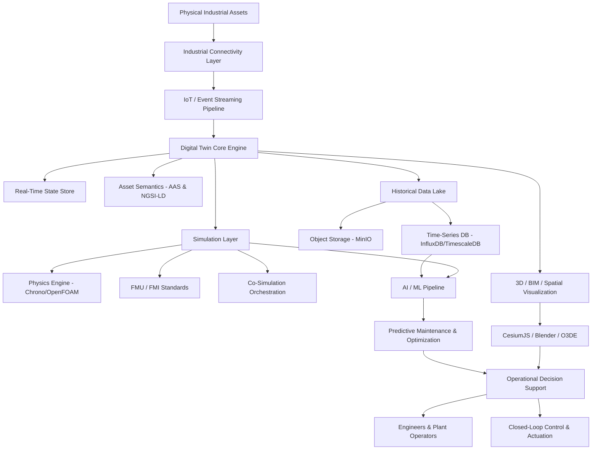
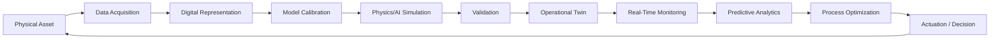

  
  
  
  
  

  

# ⚡ Awesome Simulation &amp; Digital Twin Platform 🌐

> A curated, comprehensive ecosystem guide to **Digital Twins, Industrial IoT (IIoT), Asset Administration Shells (AAS), Physics-Based Simulation, FMI/FMU Co-Simulation, 3D Spatial Twins, and Open-Source Stack Architectures**.

**Last Updated:** September 2026

---

## 📌 Table of Contents

* [🌐 Introduction &amp; Core Concepts](#-introduction--core-concepts)
* [💼 SaaS / Hosted Platforms](#-saas--hosted-platforms)
* [🛠️ Open-Source Digital Twin Platforms](#️-open-source-digital-twin-platforms)
* [⚡ Open-Source Simulation &amp; Co-Simulation](#-open-source-simulation--co-simulation)
* [📡 Open-Source IoT &amp; Edge Platforms](#-open-source-iot--edge-platforms)
* [🎨 Open-Source 3D, BIM &amp; Spatial Twin Technologies](#-open-source-3d-bim--spatial-twin-technologies)
* [🗄️ Open-Source Data &amp; Time-Series Infrastructure](#️-open-source-data--time-series-infrastructure)
* [🧠 Open-Source AI/ML for Digital Twins](#-open-source-aiml-for-digital-twins)
* [📊 Open-Source Dashboards &amp; Analytics](#-open-source-dashboards--analytics)
* [🌟 Additional Strong Open-Source Options (Ranked by Stars)](#-additional-strong-open-source-options-ranked-by-stars)
* [🔄 Commercial Platform → Open-Source Equivalents](#-commercial-platform--open-source-equivalents)
* [🏗️ Frameworks for Building Custom Digital Twin Systems](#️-frameworks-for-building-custom-digital-twin-systems)
* [📐 Reference Architecture](#-reference-architecture)
* [🔄 Digital Twin Lifecycle](#-digital-twin-lifecycle)
* [🎯 Suggested Open-Source Architecture by Use Case](#-suggested-open-source-architecture-by-use-case)
* [🤝 How to Contribute](#-how-to-contribute)
* [⚠️ Disclaimer](#️-disclaimer)
* [📈 Star History](#-star-history)

---

## 🌐 Introduction &amp; Core Concepts

Digital Twin and Simulation platforms integrate **physics-based simulation, real-time IoT telemetry, engineering models, operational data, AI/ML surrogate models, 3D visualization, and Asset Administration Shell (AAS) standards** to maintain a live digital replica of physical assets, facilities, equipment, and industrial systems.

### Leading Commercial Platforms:
* [Azure Digital Twins](https://azure.microsoft.com/products/digital-twins) · [NVIDIA Omniverse](https://www.nvidia.com/en-us/omniverse/) · [AWS IoT TwinMaker](https://aws.amazon.com/iot-twinmaker/) · [Siemens Simcenter](https://plm.sw.siemens.com/en-US/simcenter/) · [Dassault Systèmes 3DEXPERIENCE](https://www.3ds.com/3dexperience) · [Ansys Twin Builder](https://www.ansys.com/products/digital-twin/ansys-twin-builder) · [PTC ThingWorx](https://www.ptc.com/en/products/thingworx) · [AVEVA PI System](https://www.aveva.com/en/products/aveva-pi-system/) · [Bentley iTwin](https://www.bentley.com/software/itwin/) · [C3 AI Digital Twins](https://c3.ai/products/digital-twins/)

---

## 💼 SaaS / Hosted Platforms

> 📊 **Market Size & Industry Concentration Overview**: The global Digital Twin and Industrial Simulation market was valued at **~$15.3 Billion in 2024** and is projected to expand to **~$110+ Billion by 2032** (CAGR ~35–40%). The market is **moderately fragmented**: cloud hyper-scalers (Microsoft Azure, AWS, NVIDIA) dominate horizontal cloud twin graphs and spatial metaverse environments, while specialized engineering software providers (Siemens, Ansys, Dassault Systèmes, PTC, Hexagon) hold dominant positions in domain-specific physics simulation, CAD/CAE modeling, and Industry 4.0 lifecycle management.

| Platform | Company Size (Valuation / Revenue) | Primary Focus | Typical Use | Pricing | Free Tier / Trial Limits |
| --- | --- | --- | --- | --- | --- |
| [Azure Digital Twins](https://azure.microsoft.com/products/digital-twins) | ~$3.1 Trillion (Rev: ~$245B) | Cloud twin graph + IoT | Buildings, facilities, industrial assets | Starts at $0.003 per 1,000 Digital Twin operations + $0.001 per 1,000 Query Units | 30-day free trial with $200 Azure credits via Azure Free Account (plus 12 months free services) |
| [NVIDIA Omniverse](https://www.nvidia.com/en-us/omniverse/) | ~$3.0 Trillion (Rev: ~$126B) | 3D simulation + industrial metaverse | Robotics, factories, synthetic environments | Free ($0/month) for individual developers; Enterprise support starts at $4,500/year per GPU | Free forever plan for individual creators/developers (unlimited local workstation GPU use); 30-day trial for Enterprise |
| [AWS IoT TwinMaker](https://aws.amazon.com/iot-twinmaker/) | ~$2.1 Trillion (Rev: ~$620B) | IoT + 3D + operational data | Industrial/operational twins | Starts at $0.02 per 1,000 Data Access API calls ($0.00002 per request) after free tier | Free tier includes 50 million Data Access API calls/month for the first 12 months |
| [IBM Maximo Application Suite](https://www.ibm.com/products/maximo) | ~$200 Billion (Rev: ~$62B) | Asset management + analytics | Asset performance | Essentials SaaS tier starts at ~$3,150/month (~$125/user/month AppPoints equivalence) | 14-day free trial of Maximo Application Suite SaaS with pre-configured sample asset data |
| [Siemens Simcenter](https://plm.sw.siemens.com/en-US/simcenter/) | ~$150 Billion (Rev: ~$80B) | CAE + system simulation + test | Engineering & industrial simulation | Starts at ~$300/month (~$3,500/year) for Simcenter Cloud HPC / Simcenter X starter tier | 30-day free trial for Simcenter Cloud HPC (includes 500 free HPC compute credits) |
| [Schneider Electric EcoStruxure](https://www.se.com/ww/en/work/solutions/ecostruxure/) | ~$130 Billion (Rev: ~$40B) | Energy + industrial IoT | Industrial/building twins | Starts at ~$50/monitored device/year (~$250/month for 50-node IT Expert base subscription) | 30-day free trial for EcoStruxure IT Expert (monitors up to 50 SNMP devices); 90-day trial for Data Center Expert |
| [Dassault Systèmes 3DEXPERIENCE](https://www.3ds.com/3dexperience) | ~$45 Billion (Rev: ~$6.5B) | PLM + simulation + 3D experience | Product & lifecycle twins | Starts at ~$250/user/month (~$3,000/user/year) for 3DEXPERIENCE Cloud Standard roles | 14-day free trial with full platform feature access |
| [Dassault SIMULIA](https://www.3ds.com/products/simulia) | ~$45 Billion (Rev: ~$6.5B) | Multiphysics simulation | Engineering | Starts at ~$350/month (~$4,000/year) per user simulation role / token package | 30-day free evaluation via 3DEXPERIENCE Cloud trial; Abaqus Learning Edition free forever (limited to 1,000 nodes) |
| [Ansys Twin Builder](https://www.ansys.com/products/digital-twin/ansys-twin-builder) | ~$32 Billion (Rev: ~$2.3B) | Physics + reduced-order models + hybrid analytics | Engineering digital twins | Starts at ~$1,500/month (~$18,000/year) per user node license | 30-day free trial (upon request); Free Student Edition (limited to 512,000 cells/nodes for academic use) |
| [Hexagon Nexus](https://nexus.hexagon.com/) | ~$25 Billion (Rev: ~$5.8B) | Manufacturing engineering ecosystem | Connected manufacturing | Starts at ~$150/month (~$1,800/year) per user application role / compute credits | Free registration with 30-day free trial for individual Nexus cloud applications (e.g., Adams Car on Demand) |
| [PTC ThingWorx](https://www.ptc.com/en/products/thingworx) | ~$20 Billion (Rev: ~$2.3B) | Industrial IoT + applications | Manufacturing & IIoT | Starts at ~$1,000/user/month (~$12,000/year) or ~$50,000/year base Foundation license | 30-day hosted developer evaluation / 90-day academic evaluation license via PTC Academic Program |
| [PTC Vuforia](https://www.ptc.com/en/products/vuforia) | ~$20 Billion (Rev: ~$2.3B) | AR + industrial visualization | Assisted operations | Basic Plan is $0/month; Premium Plan starts at ~$42/month (~$500/year) or $99/month for Vuforia Chalk Pro | Free forever Basic Plan (supports standard targets & up to 1,000 cloud recognitions/month); 30-day trial for Vuforia Chalk |
| [Bentley iTwin](https://www.bentley.com/software/itwin/) | ~$15 Billion (Rev: ~$1.3B) | Infrastructure digital twins | Civil infrastructure, BIM | Standard Subscription starts at $199/month (includes 200 credits/mo, 50 GB cloud storage; $1.20/credit overage) | Free forever Community Subscription (100 credits/month, 10 GB cloud data, 100 GB reality storage for non-commercial use) |
| [MathWorks Simulink](https://www.mathworks.com/products/simulink.html) | ~$15 Billion (Est.) (Rev: ~$1.5B) | Dynamic system simulation | Controls & model-based design | Starts at $55/month ($540/year) standard individual license subscription | 30-day free trial (full feature trial with MATLAB/Simulink Online access); MATLAB Online Basic offers 20 free hours/month forever |
| [AVEVA PI System](https://www.aveva.com/en/products/aveva-pi-system/) | ~$12 Billion (Acquired) (Rev: ~$1.4B) | Industrial historian + operational data | Process industries | Starts at ~$1,000/month (~$12,000/year) via CONNECT data services / AVEVA Flex subscription | 45-day free trial via CONNECT Data Services (includes up to 1,000 active streams) |
| [Altair Twin Activate](https://altair.com/twin-activate) | ~$9 Billion (Rev: ~$620M) | System simulation + reduced-order models | Engineering twins | Starts at ~$150/month (~$1,800/year) via Altair Units starter package | 30-day free trial via Altair One Marketplace; Free Student Edition (valid 1 year, max 50 components/model) |
| [C3 AI Digital Twins](https://c3.ai/products/digital-twins/) | ~$3 Billion (Rev: ~$310M) | AI + enterprise digital twins | Asset intelligence | Starts at $0.55/vCPU-hour (~$2,500/month base platform fee) or ~$250,000 3-month pilot deployment | 14-day free trial of C3 AI Studio with $500 cloud compute credits |
| [COMSOL Multiphysics](https://www.comsol.com/) | ~$1 Billion (Est.) (Rev: ~$130M) | Multiphysics simulation | Physics-based twins | Starts at ~$1,600/year for annual single-user term license (~$3,995 perpetual base license) | 14-day temporary evaluation license upon sales representative approval |

---

## 🛠️ Open-Source Digital Twin Platforms

Sorted descending by GitHub star count:

1. **ThingsBoard Community Edition** 
   - **License:** Apache-2.0
   - **Focus:** Operational IoT platform, asset entity relationship mapping, rule engines, time-series data, and SCADA-style dashboards.

2. **FIWARE Orion-LD** 
   - **License:** EPL-2.0
   - **Focus:** Context Broker implementing NGSI-LD and NGSI-v2 APIs for context-aware digital twins and smart cities.

3. **Eclipse Ditto** 
   - **License:** EPL-2.0
   - **Focus:** Open-source framework for device state abstraction (desired/reported/current state), REST/WebSocket APIs, and device-as-a-service.

4. **Magistrala / Mainflux** 
   - **License:** Apache-2.0
   - **Focus:** Industrial IoT messaging platform with multi-protocol connectivity (MQTT, HTTP, WebSocket, CoAP) and device security management.

5. **Eclipse BaSyx** 
   - **License:** EPL-2.0
   - **Focus:** Asset Administration Shell (AAS) Industry 4.0 implementation providing standardized submodels and asset semantics.

6. **OpenTwins** 
   - **Focus:** Compositional open-source Digital Twin platform integrating Ditto, Kafka, InfluxDB, Grafana, and simulation wrappers.

---

## ⚡ Open-Source Simulation &amp; Co-Simulation

Sorted descending by GitHub star count:

1. **PyBullet / Bullet Physics** 
   - **License:** zlib
   - **Focus:** Real-time rigid body dynamics, multibody dynamics, robotics simulation, and reinforcement learning environments.

2. **Webots** 
   - **License:** Apache-2.0
   - **Focus:** Open-source robot simulator providing complete development environment to model, program, and simulate autonomous systems.

3. **OpenFOAM** 
   - **License:** GPL-3.0
   - **Focus:** Leading open-source Computational Fluid Dynamics (CFD) software suite for fluid dynamics, chemical reactions, and heat transfer.

4. **Project Chrono** 
   - **License:** BSD-3-Clause
   - **Focus:** Multi-physics simulation engine for multibody dynamics, vehicle dynamics, robotics, fluid-solid interaction, and granular material.

5. **Gazebo** 
   - **License:** Apache-2.0
   - **Focus:** Next-generation 3D robotics simulation platform featuring high-fidelity physics engines, sensor simulation, and ROS 2 integration.

6. **SimPy** 
   - **License:** MIT
   - **Focus:** Process-based discrete-event simulation framework in Python for modeling queues, resources, and supply-chain operations.

7. **SU2 Code** 
   - **License:** LGPL-2.1
   - **Focus:** Open-source suite for multiphysics analysis and aerodynamic shape optimization based on partial differential equations (PDEs).

8. **OpenModelica** 
   - **License:** OSMC Public License
   - **Focus:** Comprehensive Modelica-based cyber-physical system modeling, OMEdit graphical editor, OMSimulator co-simulation, and FMI support.

9. **CoolProp** 
   - **License:** MIT
   - **Focus:** Thermophysical property library for fluid simulation, HVAC systems, power plants, and thermodynamic digital twins.

10. **FEniCS dolfinx** 
    - **License:** LGPL-3.0
    - **Focus:** Next-generation finite element solver library for automated solution of partial differential equations and multiphysics modeling.

11. **Cantera** 
    - **License:** BSD-3-Clause
    - **Focus:** Chemical kinetics, thermodynamics, and transport process simulation tool for combustion, electrochemistry, and energy systems.

12. **FMPy** 
    - **License:** BSD-2-Clause
    - **Focus:** Python simulation library for executing Functional Mock-up Units (FMUs) supporting FMI 1.0, 2.0, and 3.0 standards.

13. **Mosaik** 
    - **License:** LGPL-3.0
    - **Focus:** Multi-simulator orchestration and co-simulation framework for coupling heterogeneous energy, smart-grid, and control system models.

---

## 📡 Open-Source IoT &amp; Edge Platforms

Sorted descending by GitHub star count:

1. **Node-RED** 
   - **License:** Apache-2.0
   - **Focus:** Low-code event-driven flow programming environment for IoT device integration, protocol transformation, and industrial automation.

2. **NATS Server** 
   - **License:** Apache-2.0
   - **Focus:** High-performance cloud-native messaging system for microservices, IoT telemetry, and edge-to-cloud twin streaming.

3. **Eclipse Mosquitto** 
   - **License:** EPL-2.0
   - **Focus:** Lightweight open-source MQTT message broker suitable for IoT telemetry, edge devices, and embedded digital twin messaging.

4. **EdgeX Foundry** 
   - **License:** Apache-2.0
   - **Focus:** Vendor-neutral industrial IoT edge platform providing device service abstraction, Modbus/OPC UA translation, and edge analytics.

5. **Eclipse Hono** 
   - **License:** EPL-2.0
   - **Focus:** Enterprise scalable IoT connectivity layer supporting MQTT, HTTP, AMQP, and device authentication infrastructure.

---

## 🎨 Open-Source 3D, BIM &amp; Spatial Twin Technologies

Sorted descending by GitHub star count:

1. **Blender** 
   - **License:** GPL-3.0
   - **Focus:** Open-source 3D creation suite for CAD asset pipeline modeling, photorealistic rendering, and digital twin visual assets.

2. **CesiumJS** 
   - **License:** Apache-2.0
   - **Focus:** WebGL-based 3D geospatial globe visualization platform for spatial digital twins, smart cities, terrain, and BIM models.

3. **OpenLayers** 
   - **License:** BSD-2-Clause
   - **Focus:** High-performance web mapping library for displaying geospatial asset data, vector tiles, and GIS twin layers.

4. **Open 3D Engine (O3DE)** 
   - **License:** Apache-2.0
   - **Focus:** AAA-grade modular 3D engine for real-time industrial metaverse visual simulation, virtual commissioning, and synthetic data generation.

5. **OpenStreetMap Website** 
   - **License:** AGPL-3.0
   - **Focus:** Open spatial map infrastructure feeding real-world geographical context into city and transportation digital twins.

6. **IfcOpenShell** 
   - **License:** LGPL-3.0
   - **Focus:** Open-source Industry Foundation Classes (IFC) BIM parser and geometry processing library for building and infrastructure twins.

---

## 🗄️ Open-Source Data &amp; Time-Series Infrastructure

Sorted descending by GitHub star count:

1. **MinIO** 
   - **License:** AGPL-3.0
   - **Focus:** High-performance S3-compatible object storage for CAD models, FMUs, point clouds, and historical twin telemetry datasets.

2. **Apache Spark** 
   - **License:** Apache-2.0
   - **Focus:** Unified analytics engine for large-scale historical simulation data processing and batch machine learning.

3. **ClickHouse** 
   - **License:** Apache-2.0
   - **Focus:** Columnar real-time database management system for lightning-fast SQL analytical queries over industrial twin logs.

4. **Apache Kafka** 
   - **License:** Apache-2.0
   - **Focus:** Distributed event streaming platform for real-time sensor telemetry ingestion and digital twin state synchronization.

5. **InfluxDB** 
   - **License:** MIT / AGPL-3.0
   - **Focus:** Purpose-built time-series database optimized for high-write-throughput sensor measurements and operational metrics.

6. **DuckDB** 
   - **License:** MIT
   - **Focus:** In-process analytical SQL database for querying Parquet files, simulation results, and offline digital twin analytics.

7. **Apache Flink** 
   - **License:** Apache-2.0
   - **Focus:** Stateful stream processing framework for real-time anomaly detection, sliding window metrics, and twin event computation.

8. **TimescaleDB** 
   - **License:** Timescale License / Apache-2.0
   - **Focus:** PostgreSQL-based time-series database combining SQL analytical capabilities with automated hyper-table partitioning.

9. **PostgreSQL** 
   - **License:** PostgreSQL License
   - **Focus:** Reliable object-relational database serving asset metadata, graph relationships, PostGIS spatial queries, and twin state registries.

---

## 🧠 Open-Source AI/ML for Digital Twins

Sorted descending by GitHub star count:

1. **TensorFlow** 
   - **License:** Apache-2.0
   - **Focus:** End-to-end machine learning ecosystem for predictive maintenance models, time-series forecasting, and neural surrogate twins.

2. **PyTorch** 
   - **License:** BSD-3-Clause
   - **Focus:** Dynamic deep learning framework widely used for physics-informed neural networks (PINNs), reinforcement learning, and surrogate modeling.

3. **scikit-learn** 
   - **License:** BSD-3-Clause
   - **Focus:** Machine learning library providing regression, classification, fault detection, and statistical predictive maintenance routines.

4. **XGBoost** 
   - **License:** Apache-2.0
   - **Focus:** Optimized gradient boosting library for asset remaining useful life (RUL) estimation and tabular sensor prediction.

5. **MLflow** 
   - **License:** Apache-2.0
   - **Focus:** MLOps lifecycle platform for tracking digital twin ML experiments, packaging surrogate models, and managing deployments.

6. **LightGBM** 
   - **License:** MIT
   - **Focus:** Fast gradient boosting framework for large-scale industrial sensor analytics and telemetry anomaly classification.

7. **SciPy** 
   - **License:** BSD-3-Clause
   - **Focus:** Fundamental algorithms for scientific computing, differential equation solving, optimization, and signal processing.

8. **PyOD** 
   - **License:** BSD-2-Clause
   - **Focus:** Comprehensive Python toolkit for detecting multivariate anomalies in sensor streams and monitoring digital twin health.

---

## 📊 Open-Source Dashboards &amp; Analytics

Sorted descending by GitHub star count:

1. **Grafana** 
   - **License:** AGPL-3.0
   - **Focus:** Observability and operational dashboard platform displaying real-time time-series telemetry, alerts, and industrial metrics.

2. **Apache Superset** 
   - **License:** Apache-2.0
   - **Focus:** Enterprise data exploration and visualization platform for querying time-series data lakes and simulation datasets.

3. **Metabase** 
   - **License:** AGPL-3.0
   - **Focus:** Business intelligence and dashboarding tool enabling self-service operational reporting for asset performance management.

4. **Plotly Python** 
   - **License:** MIT
   - **Focus:** Interactive graphing library for rendering 3D surface plots, engineering charts, and simulation analysis figures.

---

## 🌟 Additional Strong Open-Source Options (Ranked by Stars)

| Project | Category | GitHub_Stars Badge | Description |
| --- | --- | --- | --- |
| [TensorFlow](https://github.com/tensorflow/tensorflow) | AI / ML |  | Deep learning framework for industrial anomaly detection |
| [PyTorch](https://github.com/pytorch/pytorch) | AI / ML |  | Physics-informed ML & neural surrogate digital twins |
| [Grafana](https://github.com/grafana/grafana) | Visualization |  | Industrial telemetry & operational twin dashboards |
| [Apache Superset](https://github.com/apache/superset) | Visualization |  | Data exploration & simulation dataset reporting |
| [scikit-learn](https://github.com/scikit-learn/scikit-learn) | AI / ML |  | Predictive maintenance & fault detection algorithms |
| [MinIO](https://github.com/minio/minio) | Object Data |  | S3-compatible storage for CAD models & FMU files |
| [Apache Spark](https://github.com/apache/spark) | Data Lake |  | Distributed batch processing for historical simulation logs |
| [Metabase](https://github.com/metabase/metabase) | Visualization |  | Self-service asset performance dashboarding |
| [ClickHouse](https://github.com/ClickHouse/ClickHouse) | Data / SQL |  | Columnar database for fast twin telemetry analytics |
| [Apache Kafka](https://github.com/apache/kafka) | Streaming |  | Real-time event streaming & sensor telemetry queue |
| [InfluxDB](https://github.com/influxdata/influxdb) | Time-Series |  | Time-series database for continuous sensor ingestion |
| [XGBoost](https://github.com/dmlc/xgboost) | AI / ML |  | Gradient boosting for asset failure prediction & RUL |
| [DuckDB](https://github.com/duckdb/duckdb) | Analytics |  | In-process analytical SQL engine for simulation files |
| [Apache Flink](https://github.com/apache/flink) | Streaming |  | Real-time stream processing & stateful twin analytics |
| [Node-RED](https://github.com/node-red/node-red) | IoT / Flow |  | Low-code event-driven IoT integration flows |
| [MLflow](https://github.com/mlflow/mlflow) | MLOps |  | Machine learning experiment tracking for surrogate twins |
| [ThingsBoard](https://github.com/thingsboard/thingsboard) | Digital Twin |  | Operational IoT entity mapping & dashboards |
| [TimescaleDB](https://github.com/timescale/timescaledb) | Time-Series |  | PostgreSQL-based time-series hypertable engine |
| [PostgreSQL](https://github.com/postgres/postgres) | Database |  | Relational database with PostGIS for spatial metadata |
| [Plotly Python](https://github.com/plotly/plotly.py) | Analytics |  | Interactive 3D plotting & simulation charting |
| [LightGBM](https://github.com/microsoft/LightGBM) | AI / ML |  | Fast gradient boosting for sensor anomaly classification |
| [NATS Server](https://github.com/nats-io/nats-server) | Messaging |  | High-performance messaging for cloud/edge twins |
| [Blender](https://github.com/blender/blender) | 3D Engine |  | 3D visual asset creation & BIM conversion pipeline |
| [SciPy](https://github.com/scipy/scipy) | Scientific |  | Numerical differential equation solving & optimization |
| [PyBullet](https://github.com/bulletphysics/bullet3) | Physics |  | Real-time multibody dynamics & robotics simulation |
| [CesiumJS](https://github.com/CesiumGS/cesium) | 3D / GIS |  | WebGL 3D geospatial globe & BIM spatial twin rendering |
| [OpenLayers](https://github.com/openlayers/openlayers) | GIS Map |  | Web vector mapping for spatial asset overlays |
| [Mosquitto](https://github.com/eclipse-mosquitto/mosquitto) | MQTT |  | Lightweight MQTT telemetry broker |
| [PyOD](https://github.com/yzhao062/pyod) | Anomaly |  | Python multivariate anomaly detection framework |
| [O3DE](https://github.com/o3de/o3de) | 3D Engine |  | AAA 3D engine for industrial virtual commissioning |
| [OpenStreetMap](https://github.com/openstreetmap/openstreetmap-website) | Spatial Data |  | Open geospatial map context for city digital twins |
| [Webots](https://github.com/cyberbotics/webots) | Robotics |  | Autonomous robot & physics simulation environment |
| [OpenFOAM](https://github.com/OpenFOAM/OpenFOAM-dev) | CFD Physics |  | Computational Fluid Dynamics (CFD) solver suite |
| [Project Chrono](https://github.com/projectchrono/chrono) | Physics |  | Multibody mechanics & granular dynamics engine |
| [IfcOpenShell](https://github.com/IfcOpenShell/IfcOpenShell) | BIM / IFC |  | Open-source IFC parsing & BIM geometry processing |
| [Gazebo](https://github.com/gazebosim/gz-sim) | Robotics |  | 3D robotics simulation environment for ROS 2 |
| [SU2 Code](https://github.com/SU2code/SU2) | Aerodynamics |  | PDE & aerodynamic shape optimization solver |
| [SimPy](https://github.com/simpx/simpy) | Simulation |  | Process-based discrete event simulation library |
| [FIWARE Orion-LD](https://github.com/FIWARE/context.Orion-LD) | Context |  | NGSI-LD context broker for smart city digital twins |
| [Eclipse Ditto](https://github.com/eclipse-ditto/ditto) | Twin Backend |  | Digital Twin state layer & device API abstraction |
| [EdgeX Foundry](https://github.com/edgexfoundry/edgex-go) | Edge IIoT |  | Industrial IIoT edge gateway framework |
| [OpenModelica](https://github.com/OpenModelica/OpenModelica) | Modelica |  | Modelica physics system modeling & OMSimulator |
| [Magistrala](https://github.com/absmach/magistrala) | IIoT Cloud |  | Multi-protocol IIoT messaging platform |
| [CoolProp](https://github.com/CoolProp/CoolProp) | Thermodynamics |  | Thermophysical fluid property calculation engine |
| [FEniCS dolfinx](https://github.com/fenics/dolfinx) | PDE Solver |  | Automated finite element multiphysics solver |
| [Cantera](https://github.com/Cantera/cantera) | Kinetics |  | Chemical kinetics & thermodynamics simulation |
| [FMPy](https://github.com/CATIA-Systems/FMPy) | FMI / FMU |  | Python execution framework for FMU co-simulation |
| [Eclipse Hono](https://github.com/eclipse-hono/hono) | IoT Backend |  | Scalable IoT telemetry & device connectivity |
| [Eclipse BaSyx](https://github.com/eclipse-basyx/basyx-java-sdk) | AAS Semantics |  | Asset Administration Shell Industry 4.0 SDK |
| [Mosaik](https://github.com/OFFIS-mosaik/mosaik) | Co-Simulation |  | Smart grid & multi-simulator orchestration |
| [OpenTwins](https://github.com/ertis-research/opentwins) | Digital Twin |  | Compositional open-source Digital Twin platform |

---

## 🔄 Commercial Platform → Open-Source Equivalents

| Commercial Platform | Main Capability | Strong Open-Source Alternatives |
| --- | --- | --- |
| **Ansys Twin Builder** | Physics + system simulation + digital twins | OpenModelica + FMPy + Mosaik + Project Chrono + PyTorch |
| **Siemens Simcenter** | CAE + system simulation + testing | OpenModelica + FMPy + Mosaik + Gazebo + OpenFOAM |
| **Dassault 3DEXPERIENCE** | PLM + simulation + 3D experience | OpenModelica + IfcOpenShell + Blender + O3DE + CesiumJS |
| **Azure Digital Twins** | Twin graph + IoT + cloud infrastructure | Eclipse Ditto + FIWARE Orion-LD + ThingsBoard + Kafka |
| **AWS IoT TwinMaker** | IoT + 3D + operational data integration | Eclipse Ditto + Hono + InfluxDB + CesiumJS + Grafana |
| **PTC ThingWorx** | Industrial IoT + application execution | ThingsBoard + EdgeX Foundry + Ditto + Node-RED |
| **Altair Twin Activate** | System modeling + reduced-order simulation | OpenModelica + FMPy + Mosaik + SciPy |
| **C3 AI Digital Twins** | AI + enterprise asset twin analytics | Ditto + FIWARE + PyTorch + XGBoost + MLflow |
| **AVEVA PI System** | Industrial historian + operational data | InfluxDB + TimescaleDB + ClickHouse + PostgreSQL |
| **Bentley iTwin** | Infrastructure / BIM digital twins | IfcOpenShell + CesiumJS + Blender + O3DE + PostGIS |
| **NVIDIA Omniverse** | 3D + physics + synthetic data simulation | O3DE + Blender + Gazebo + PyBullet + CesiumJS |
| **Dassault SIMULIA** | Multiphysics & structural simulation | OpenModelica + Project Chrono + OpenFOAM + FEniCS |
| **MathWorks Simulink** | Dynamic system modeling & control design | OpenModelica + FMPy + Python Scientific Stack |

---

## 🏗️ Frameworks for Building Custom Digital Twin Systems

A high-performance open-source Digital Twin system can be constructed as a modular layered stack:

| Layer | Recommended Open-Source Technologies |
| --- | --- |
| **Physical Assets** | Industrial Sensors · PLCs · Autonomous Robots · Machines · Edge Nodes |
| **Industrial Connectivity** | EdgeX Foundry · Eclipse Hono · OPC UA · Modbus · MQTT |
| **Event Streaming** | Apache Kafka · NATS Server · Eclipse Mosquitto |
| **Digital Twin Core** | Eclipse Ditto · Eclipse BaSyx · FIWARE Orion-LD |
| **Asset Semantics** | Asset Administration Shell (AAS) · NGSI-LD · OPC UA Information Models |
| **Time-Series Engine** | InfluxDB · TimescaleDB · ClickHouse |
| **Data Lake / Storage** | MinIO · Apache Parquet · DuckDB |
| **System Simulation** | OpenModelica · FMPy · Mosaik Co-Simulation |
| **Physics Solver** | Project Chrono · OpenFOAM · PyBullet · FEniCS dolfinx |
| **AI / Machine Learning** | PyTorch · XGBoost · scikit-learn · LightGBM · MLflow · PyOD |
| **Workflow Automation** | Node-RED · Apache Airflow |
| **3D & Spatial** | CesiumJS · Blender · Open 3D Engine (O3DE) · OpenLayers |
| **BIM / Infrastructure** | IfcOpenShell · Bonsai BIM |
| **Dashboards & UI** | Grafana · Apache Superset · Metabase · Plotly |
| **Orchestration & Ops** | Docker · Kubernetes · Prometheus |

---

## 📐 Reference Architecture

---

## 🔄 Digital Twin Lifecycle

---

## 🎯 Suggested Open-Source Architecture by Use Case

| Use Case | Recommended Open-Source Technology Stack |
| --- | --- |
| **IoT Digital Twin** | Eclipse Ditto + Eclipse Hono + Apache Kafka + InfluxDB |
| **Industry 4.0 Asset Semantics** | Eclipse BaSyx + AAS Submodels + OPC UA + Kafka |
| **Smart City & Urban Twin** | FIWARE Orion-LD + NGSI-LD + CesiumJS + PostGIS |
| **Smart Factory & Line Twin** | EdgeX Foundry + Eclipse Ditto + Kafka + Grafana |
| **Physics-Based System Twin** | OpenModelica + FMPy + FMI + PyTorch |
| **Complex Co-Simulation** | OpenModelica + FMPy + Mosaik + SciPy |
| **Robotics & Autonomous Systems** | Gazebo + ROS 2 + PyBullet + O3DE |
| **Infrastructure & BIM Twin** | IfcOpenShell + CesiumJS + PostGIS + Blender |
| **Building Energy Twin** | IFC/BIM + CesiumJS + IoT + EnergyPlus |
| **Predictive Maintenance** | Eclipse Ditto + InfluxDB + PyTorch + XGBoost + PyOD |
| **AI Neural Surrogate Twin** | Eclipse Ditto + PyTorch + MLflow + TimescaleDB |
| **Industrial Historian Stack** | TimescaleDB / InfluxDB + ClickHouse + Grafana |
| **3D Industrial Metaverse Twin** | Open 3D Engine (O3DE) + CesiumJS + Blender |

---

## 🤝 How to Contribute

Contributions from the global Digital Twin community are warmly welcomed!

### You can contribute by:
* Adding open-source Digital Twin, simulation, or AAS projects.
* Submitting FMI/FMU co-simulation frameworks or physics solvers.
* Adding industrial IoT edge protocols, smart city frameworks, or BIM tools.
* Improving documentation, architecture diagrams, or deployment guides.
* Correcting star counts or reporting outdated project URLs.

Check out our [Awesome-Awesome-Awesome](https://github.com/ishandutta2007/Awesome-Awesome-Awesome) curated index for more awesome lists!

---

## ⚠️ Disclaimer

This repository is intended as a **technology discovery and comparison resource**. Commercial platforms and open-source projects have varying feature scopes and operational requirements.

---

## 📈 Star History

